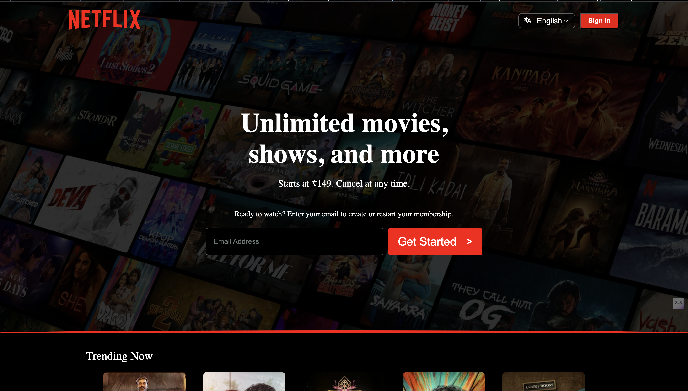

# netflix‐ui‐practice  – HTML & CSS

A Netflix Clone UI built using pure HTML and CSS.
This project is a front-end recreation of Netflix’s modern interface, designed to improve my skills in layout design, components styling, and UI replication.

## 🚀 Features
• 📺 Modern Netflix Homepage UI
• 🎨 Pixel-perfect layout inspired by the real Netflix website
• 🔥 Custom banners, cards, gradients, and hero section
• 💠 Clean & reusable components
•🌈 Advanced CSS techniques (flexbox, grid, gradients, overlays)

## 🛠️ Technologies Used
• HTML5
• CSS3
• Flexbox
• Grid
• Gradients
• Animations
• Responsive design

## 📸 Preview

## 📂 Project Structure
<pre>

Netflix-Clone/
│── index.html
│── style.css
│── assets/
│   ├── images/
│   ├── logos/
│   └── icons/

</pre>

## 🎯 What I Learned
• Structuring large UI layouts using pure HTML & CSS
• Creating responsive sections using Flexbox & Grid
• Designing smooth gradients and Netflix-style cards•	Managing SVGs,      icons, and background images
• Improving code structure for real-world projects

## ⭐ Why This Project?

I built this project to sharpen my front-end development skills and get hands-on experience recreating a professional-grade UI without using any frameworks.
My goal is to understand the fundamentals deeply and apply them in real projects.

## 🚧 Future Improvements
 • Adding JavaScript for interactive features
 • Creating a login page
 • Adding dynamic user profiles
 • Creating mobile navigation & animations

## 💡 How to Run

Simply open index.html in your browser — no installation required.

## 🙌 Acknowledgements

Inspired by Netflix’s official website UI.
This project is for learning purposes only.
